# Consensus-Adjacent Code Deep Dive

This page provides a detailed examination of the ~4% of Bitcoin Knots code changes that touch files near consensus-critical areas. While these files are "consensus-adjacent," the changes themselves do not alter Bitcoin's consensus rules.

:::info Why This Matters
Understanding what code is actually changed — and more importantly, what it does — is essential for evaluating Knots' safety. This page provides the technical detail that the [Code Analysis](/architecture/code-analysis) overview summarizes.
:::

## Overview

The consensus-adjacent changes fall into four categories:

| Category | Lines Changed | Nature of Changes |
|----------|---------------|-------------------|
| **validation.cpp** | ~500 insertions | Policy hooks, performance |
| **script/** | ~500 insertions | Descriptors, signing, NOT validation |
| **consensus/** | ~150 insertions | Mostly structure/comments |
| **bitcoinconsensus** | 252 insertions | Restored Core code |

**Total: ~1,400 lines (~4% of all changes)**

## 1. validation.cpp Changes

`validation.cpp` is the heart of Bitcoin's block validation. Changes here warrant careful scrutiny — but examination reveals they're policy additions, not consensus changes.

### Policy Option Hooks

The primary changes add configurable policy options:

```cpp
// These are POLICY variables, not consensus rules
SpkReuseModes SpkReuseMode;           // Address reuse policy
ignore_rejects_type m_ignore_rejects; // Configurable rejection reasons
```

These control what transactions your node **relays**, not what blocks it **accepts**. The distinction is crucial:

| Aspect | Policy (Relay) | Consensus (Validation) |
|--------|----------------|------------------------|
| Affects | Your mempool | Block acceptance |
| Can fork network? | No | Yes |
| Configurable? | Yes | No (must match network) |

### Performance Improvements

```cpp
// Randomize database write timing to prevent network synchronization
static constexpr auto DATABASE_WRITE_INTERVAL_MIN{50min};
static constexpr auto DATABASE_WRITE_INTERVAL_MAX{70min};
```

This adds jitter to database writes — a performance/privacy improvement that doesn't affect validation.

### Explicitly Non-Consensus Functions

Some additions are explicitly marked as non-consensus:

```cpp
/** Compute accurate total signature operation cost of a transaction.
 *  Not consensus-critical, since legacy sigops counting is always
 *  used in the protocol.
 */
int64_t GetAccurateTransactionSigOpCost(const CTransaction& tx, ...)
```

The function comment explicitly states it's not consensus-critical. It provides more accurate sigop counting for policy decisions, while consensus still uses the standard method.

### What's NOT Changed

Critical consensus functions remain untouched:

- `CheckBlock()` — Block structure validation
- `ContextualCheckBlock()` — Block context validation
- `CheckTransaction()` — Transaction validation
- `ConnectBlock()` — UTXO set updates
- Softfork activation logic (BIP9, BIP341, etc.)

### Verification

```bash
# See validation.cpp changes yourself
git clone https://github.com/bitcoinknots/bitcoin.git
cd bitcoin && git checkout v29.2.knots20251110
git remote add core https://github.com/bitcoin/bitcoin.git
git fetch core v29.0

# View the diff
git diff FETCH_HEAD..HEAD -- src/validation.cpp | less

# Search for consensus-critical function changes
git diff FETCH_HEAD..HEAD -- src/validation.cpp | grep -E "CheckBlock|ConnectBlock|CheckTransaction"
```

## 2. script/ Directory Changes

The `script/` directory contains Bitcoin's Script interpreter. Changes here could theoretically affect consensus — but examination shows they don't.

### What Changed

| File | Changes | Purpose |
|------|---------|---------|
| `descriptor.cpp` | Enhanced | More descriptor types |
| `sign.cpp` | Enhanced | BIP-322 message signing |
| `signingprovider.cpp` | Enhanced | Codex32 seed support |
| `interpreter.cpp` | Minimal | Comments only |

### Descriptor Enhancements

```cpp
// Extended descriptor support for more address types
// These affect WALLET functionality, not consensus validation
```

Descriptors are a wallet abstraction for deriving addresses. Changes here affect how your wallet generates addresses, not how the network validates transactions.

### BIP-322 Message Signing

```cpp
// BIP-322 generic message signing
// This is an APPLICATION-LAYER feature, not consensus
```

BIP-322 provides a standard way to sign messages with Bitcoin keys. It's used for proving ownership, not transaction validation.

### What's NOT Changed

The core Script interpreter (`interpreter.cpp`) has minimal changes:

```bash
# Check interpreter changes
git diff FETCH_HEAD..HEAD -- src/script/interpreter.cpp | wc -l
# Result: Very few lines, mostly comments
```

Critical functions remain untouched:
- `EvalScript()` — Script execution
- `VerifyScript()` — Script verification
- Opcode implementations

## 3. consensus/ Directory Changes

The `consensus/` directory contains consensus parameters and rules.

### What Changed

```bash
git diff FETCH_HEAD..HEAD --stat -- src/consensus/
```

Changes are primarily:
- Comments and documentation
- Code organization
- No changes to actual consensus parameters

### Consensus Parameters

The actual consensus values remain identical:

```cpp
// These values are UNCHANGED from Core
static const unsigned int MAX_BLOCK_WEIGHT = 4000000;
static const int WITNESS_SCALE_FACTOR = 4;
static const size_t MIN_TRANSACTION_WEIGHT = WITNESS_SCALE_FACTOR * 60;
static const size_t MIN_SERIALIZABLE_TRANSACTION_WEIGHT = ...;
```

### Verification

```bash
# Compare consensus parameters
git diff FETCH_HEAD..HEAD -- src/consensus/consensus.h

# You'll see: no changes to actual consensus values
```

## 4. bitcoinconsensus Library

The `bitcoinconsensus` library is **restored Bitcoin Core code**, not new Knots code.

### History

1. Bitcoin Core originally included `libbitcoinconsensus` for external validation
2. Core removed it in v28 (deemed unmaintained)
3. Knots restored it for backward compatibility

### The Code

```cpp
// Copyright (c) 2009-2010 Satoshi Nakamoto
// Copyright (c) 2009-2022 The Bitcoin Core developers
```

This is original Core code with Core copyright headers. It was:
- Written by Core developers
- Reviewed when originally merged
- Used in production for years
- Simply restored, not modified

### Why It Matters

Some applications used `libbitcoinconsensus` for:
- SPV validation
- Block explorers
- Alternative implementations

Knots maintains this compatibility.

## Code Flow Analysis

Understanding how validation works helps assess risk:

```mermaid
flowchart TD
    TX[/"📨 Transaction Arrives"/]

    subgraph POLICY["🔧 POLICY CHECKS (mempool)"]
        direction TB
        P1["rejectparasites"]
        P2["rejecttokens"]
        P3["datacarriersize"]
        P4["other policy options"]
    end

    PROPAGATE["📡 Propagated to peers"]
    MINER["⛏️ Miner includes in block"]

    subgraph CONSENSUS["🔒 CONSENSUS CHECKS (block validation)"]
        direction TB
        C1["CheckBlock()"]
        C2["ContextualCheckBlock()"]
        C3["ConnectBlock()"]
    end

    CHAIN[("⛓️ Block added to chain")]

    TX --> POLICY
    POLICY -->|"Accepted to mempool"| PROPAGATE
    POLICY -.->|"Rejected by policy"| REJECT["❌ Not relayed"]
    PROPAGATE --> MINER
    MINER --> CONSENSUS
    CONSENSUS -->|"Valid"| CHAIN
    CONSENSUS -.->|"Invalid"| INVALID["❌ Block rejected"]

    style POLICY fill:#4A90A4,stroke:#3D7A8C,color:#fff
    style CONSENSUS fill:#2d5a3d,stroke:#1e3d29,color:#fff
    style TX fill:#6BADC0,stroke:#5BA0B4,color:#fff
    style CHAIN fill:#8BC4D4,stroke:#6BADC0,color:#000
```



**Key insight:**
- **Blue box (Policy)**: Knots changes HERE — configurable, affects your node only
- **Green box (Consensus)**: Knots does NOT change this — must match network

Knots policy changes only affect the first box. Consensus validation is unchanged.

## Diff Statistics

Precise line counts for consensus-adjacent files:

```bash
# Run these commands to verify

# validation.cpp
git diff FETCH_HEAD..HEAD --stat -- src/validation.cpp
# ~500 insertions, ~150 deletions

# script/
git diff FETCH_HEAD..HEAD --stat -- src/script/
# ~500 insertions, ~100 deletions

# consensus/
git diff FETCH_HEAD..HEAD --stat -- src/consensus/
# ~150 insertions, ~50 deletions

# Total consensus-adjacent
git diff FETCH_HEAD..HEAD --stat -- src/validation.cpp src/script/ src/consensus/
```

## Risk Assessment

| Change Type | Files | Risk Level | Reasoning |
|-------------|-------|------------|-----------|
| Policy hooks | validation.cpp | **Low** | Configurable, relay only |
| Performance | validation.cpp | **None** | Doesn't affect validation |
| Descriptors | script/ | **None** | Wallet feature |
| BIP-322 | script/ | **None** | Application layer |
| Restored code | bitcoinconsensus | **None** | Original Core code |
| Consensus params | consensus/ | **None** | Values unchanged |

## The Key Question

When evaluating consensus-adjacent code, ask:

1. **Does it change validation rules?** → No
2. **Does it change consensus parameters?** → No
3. **Could it cause a network fork?** → No
4. **Is it configurable/optional?** → Yes (mostly)
5. **Was it reviewed?** → Yes (Core PRs, post-merge review)

## Expert Review

If you want to commission a professional audit of Knots' consensus-adjacent code:

1. The scope is manageable (~1,400 lines)
2. Focus on `validation.cpp` policy hooks
3. Verify `interpreter.cpp` is unchanged
4. Confirm consensus parameters match Core

## Verify Everything

Don't trust this documentation — verify:

```bash
#!/bin/bash
# audit-consensus-adjacent.sh

git clone https://github.com/bitcoinknots/bitcoin.git
cd bitcoin
git checkout v29.2.knots20251110
git remote add core https://github.com/bitcoin/bitcoin.git
git fetch core v29.0

echo "=== validation.cpp changes ==="
git diff FETCH_HEAD..HEAD --stat -- src/validation.cpp

echo -e "\n=== script/ changes ==="
git diff FETCH_HEAD..HEAD --stat -- src/script/

echo -e "\n=== consensus/ changes ==="
git diff FETCH_HEAD..HEAD --stat -- src/consensus/

echo -e "\n=== Check for changes to critical functions ==="
git diff FETCH_HEAD..HEAD -- src/script/interpreter.cpp | head -50

echo -e "\n=== Consensus parameters comparison ==="
git diff FETCH_HEAD..HEAD -- src/consensus/consensus.h
```

## Summary

The ~1,400 lines of consensus-adjacent code in Knots:

1. **Do not change consensus rules** — Block validation is identical to Core
2. **Are primarily policy options** — Configurable relay behavior
3. **Include restored Core code** — Already reviewed, just restored
4. **Are independently verifiable** — Commands provided above

The claim that Knots has "dangerous consensus changes" is not supported by code examination. The consensus-adjacent code adds policy flexibility while leaving actual consensus validation untouched.

## See Also

- [Code Analysis](/architecture/code-analysis) — High-level breakdown
- [Differences from Core](/getting-started/differences-from-core) — Feature comparison
- [FAQ](/reference/faq) — Common questions
